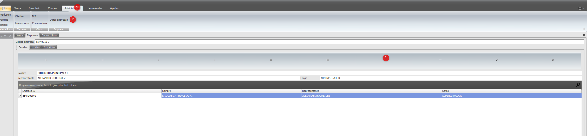

# Inventario Inicial

## en un proceso de sistematización de software para empresa lo primero que se debe realizar, es permitir que el software modele su negocio.

en algunos casos esto es llamado inventario inicial.

pasos para crearlo:

	- crear la empresa (administrador - datos empresas)
		- detalles de la empresa
    
		- locales y las cajas a usar
		- inmuebles( opcional )
	  - se crean los consecutivos 
    - se definen todos los IVA soportado por su negocio
    - se crea los posibles clientes, es de obliglación crear al menos un cliente(el cliente general), se pueden crear referencias( opcional )
    - se crean todos los posibles proveedores que tendrán su negocio(puede agregar más en el futuro a medida que lo requiera), los proveedores pueden tener represantes para contactos( opcional )    
    - se procede a definir las estibas(es una convención en donde se encuentran los productos, se puede entender como una enumeración lógica de ubicación, ejemplo: 1-C )
    - se procede a crear las familias ( también se entiende como etiqueta ) para permitir una categorización de productos( opcional )
    - se procede a registrar todos los productos de su negocio:
      - se recomienda una un lector de codigo de barra y un teclado para esta operación
      - puede definir los proveedores del producto, etiquetas(familias)
      - en codigo va el codigo de barra
      - los productos alternos son asociaciones que puede hacer para definir alternativas a un producto, ejemplo: para el Dolex un producto alterno es Acetaminofén  ( opcional )      
      - en la sección de unidades, define los posibles precios que tendrá su producto(máximo 3 posibles precios)
      - la unidad es un concepto clave, ya que nos permite agrupar un productos en diferentes nomenclatura:
        - dolex: unidad 1, un sobre de doles a otro tipo de unidad, con una equivalencia de 10
          dolex => 1
          sobre dolex => 10  (significa 1 sobre de dolex, equivale a 10 unidades de dolex)

          se aconseja siempre empezar con la unidad 1, y luego seguir creando mas unidades superiores

    - llegados a este pudo es importante realizar solo una sola vez, el inventario inicial, consiste en registrar todo su negocio con el total de productos existente( por esto se recomienda haciendo en momentos nocturnos o fines de semana para no alterar el inventario)

  - luego de creado el inventario ya se puede usar el dia a dia el sistema, con Ventas y Compras.

  

